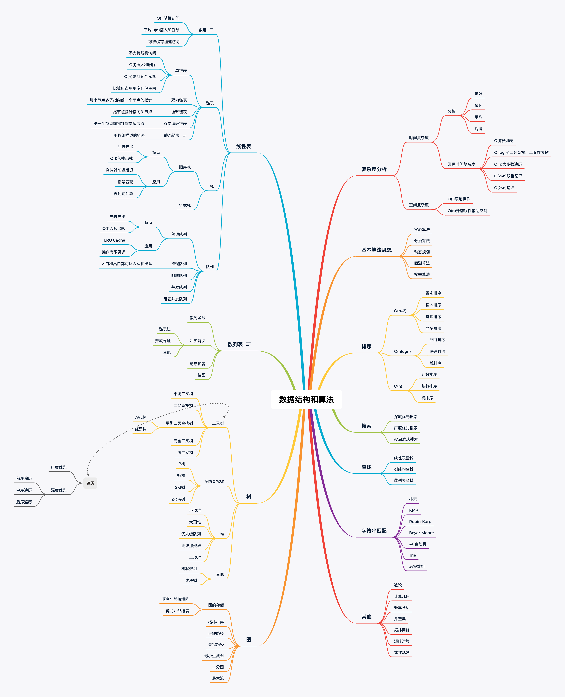

# 数据结构与算法总览

## 数据结构

- 一维
  - 基础：数组 array（string）、链表 linked list
  - 高级：栈 stack、队列 queue、双端队列 deque、集合 set、映射 map（hash or map），etc
- 二维
  - 基础：数 tree、图 graph
  - 高级：二叉搜索树 binary search tree（red-black tree，AVL），堆 heep，并查集 disjoint set，字典数 Trie，etc
- 特殊（特定工程衍生出来的）
  - 位运算 Bitwise，布隆过滤器 BloomFilter
  - LRU Cache（考的最多）

## 算法

基础算法
- If-else，switch-》branch
- for，while loop-》Iteration
- 递归 Recursion（Divide & Conquer，Backtrace）

高级算法，到最后也会演化成基础算法的一个个重复单元

- 搜索 Search：深度优先搜索 Depth first search，广度优先搜索 Breadth first search，A*，etc
- 动态规划 Dynamic Programming
- 二分查找 Binary Search
- 贪心 Greedy
- 数学Math，几何 Geometry

注意：在头脑中回忆上面每种算法的思想和代码模版

# 时间复杂度和空间复杂度

## 时间复杂度

O(1)--O(logn)--O(n)--O(n^2)--O(n^3)--O(n!)

## 空间复杂度

- 数组的长度
- 递归的深度

Tips:

<a href="https://www.zhihu.com/question/21387264">如何理解算法时间复杂度的表示法</a>

<a href="http://en.wikipedia.org/wiki/Master_theorem_(analysis_of_algorithms)">Master theorem</a>

<a href="https://zh.wikipedia.org/wiki/%E4%B8%BB%E5%AE%9A%E7%90%86">主定理</a>

# 数组、链表、跳表

## 数组

## 链表

链表算法很固定，要多做，熟能生巧

## 跳表

参考链接

- <a href="http://developer.classpath.org/doc/java/util/ArrayList-source.html">Java 源码分析（ArrayList）</a>
- <a href="http://www.geeksforgeeks.org/implementing-a-linked-list-in-java-using-class/">Linked List 的标准实现代码</a>
- <a href="http://www.cs.cmu.edu/~adamchik/15-121/lectures/Linked%20Lists/code/LinkedList.java">Linked List 示例代码</a>
- <a href="http://developer.classpath.org/doc/java/util/LinkedList-source.html">Java 源码分析（LinkedList）</a>
- <a href="http://leetcode-cn.com/problems/lru-cache">LRU Cache - Linked list： LRU 缓存机制</a>
- Redis - Skip List：<a href="http://redisbook.readthedocs.io/en/latest/internal-datastruct/skiplist.html">跳跃表</a>、<a href="http://www.zhihu.com/question/20202931">为啥 Redis 使用跳表（Skip List）而不是使用 Red-Black？</a>

# 栈、队列、优先队列、双端队列

栈：先进后出，添加、删除皆为O(1)

队列：先进先出,添加、删除O(1)

怎么实现上面的数据结构，可以在Google上搜索，例如Java stack 12

Priority Queue:插入操作O(1);取出操作O(logn),按照元素优先级取出；底层具体实现的数据结构较为复杂和多样性：heap、bst、treap

各个数据结构分析图，<a href="https://www.bigocheatsheet.com/">数据来源</a>

参考链接

- <a href="http://docs.oracle.com/javase/10/docs/api/java/util/PriorityQueue.html"> Java 的 PriorityQueue 文档</a>
- <a href="http://developer.classpath.org/doc/java/util/Stack-source.html/"> Java 的 Stack 源码</a>
- <a href="http://fuseyism.com/classpath/doc/java/util/Queue-source.html"> Java 的 Queue 源码</a>
- <a href="http://docs.python.org/2/library/heapq.html"> Python 的 heapq</a>
- <a href="http://docs.python.org/2/library/collections.html">高性能的 container 库</a>
